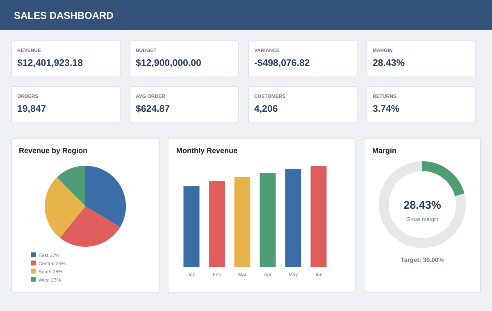
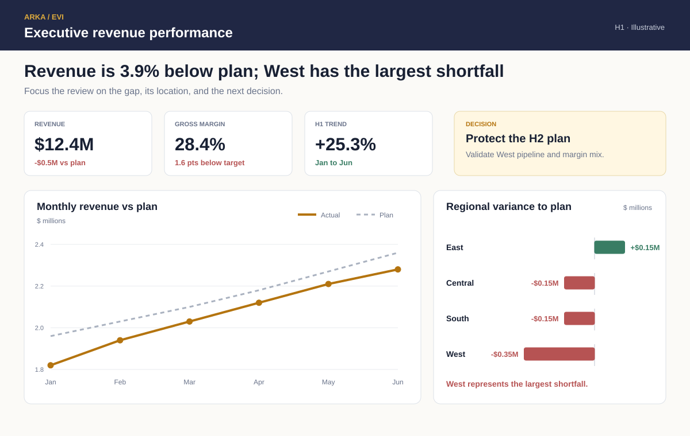

# Arka EVI Portfolio

**Enterprise Visual Intelligence turns business requirements into clear, decision-ready reporting.**

This portfolio presents reporting and dashboard redesigns from [Arka Integrated Solutions](https://arkaisllc.com/). Each case study starts with the decision a reader needs to make, examines the work the current report asks them to do, and shows how structure, visual choice, labeling, and emphasis can make the answer easier to understand.

[View the public portfolio](https://arkaisllc.github.io/arka-evi-portfolio/) · [Explore Enterprise Visual Intelligence](https://arkaisllc.com/enterprise-visual-intelligence/) · [Request an EVI report review](mailto:info@arkaisllc.com?subject=EVI%20Report%20Review)

## Featured case study

### 15 categories in a pie chart

**Business question:** Which categories generate the most sales, and how far apart are they?

Both visuals contain the same fictional annual sales data. The redesign changes how directly the reader can answer the question.

| Before | After |
|---|---|
|  |  |
| Match fifteen colors, compare angles, and move between the chart and legend. | Compare lengths on a shared baseline and read labels beside the values. |

The ranked bars reveal the finding immediately: **Electronics and Furniture lead sales, and the top five categories contribute 64% of total revenue.**

[View the complete case study](case-studies/15-categories-pie-chart/README.md) · [Read the published article](https://arkaisllc.com/articles/15-categories-pie-chart-sales-data/)

### Executive revenue dashboard

**Business question:** Where is performance falling behind plan, and what should leadership investigate first?

| Before | After |
|---|---|
|  |  |

The optimized version connects the headline, variance, location of the gap, and management action in one reading path.

[View the executive revenue case study](case-studies/executive-revenue-dashboard/README.md)

### P&L variance report

**Business question:** Why is operating income below budget, and which drivers require attention?

| Before | After |
|---|---|
|  |  |

The optimized version preserves the financial structure while making the $0.57M operating-income gap and its drivers visible.

[View the P&L variance case study](case-studies/pnl-variance-report/README.md)

### On-time delivery dashboard

**Business question:** What is driving the service decline, and where should operations intervene?

| Before | After |
|---|---|
|  |  |

The optimized version shows that OTIF declined 4.6 points and that carrier capacity and picking delays account for 61% of exceptions.

[View the on-time delivery case study](case-studies/on-time-delivery-dashboard/README.md)

## What an EVI review examines

- The audience, decision, and business question
- Visual forms that fit the comparison being made
- Hierarchy, layout, labels, color, and precision
- Context needed to interpret a result correctly
- Changes that reduce effort without hiding useful detail
- Practical implementation guidance for the reporting team

## Example deliverables

The featured case study includes the artifacts a client can expect from a focused EVI review:

- [Design rationale](case-studies/15-categories-pie-chart/design-rationale/design-decisions.md)
- [Example review summary](case-studies/15-categories-pie-chart/deliverable-example/review-summary.md)
- [Fictional sample data](case-studies/15-categories-pie-chart/sample-data/sales-by-category.csv)

## Work with Arka

Send an anonymized screenshot or PDF to [info@arkaisllc.com](mailto:info@arkaisllc.com?subject=EVI%20Report%20Review). Include who uses the report, what they need to understand, and what decision follows.

Arka Integrated Solutions serves organizations that need dependable data engineering, analytics, reporting, and clearer visual communication.

---

All data in this portfolio is fictional unless a case study explicitly states otherwise. Client work is published only with permission and with confidential information removed.
