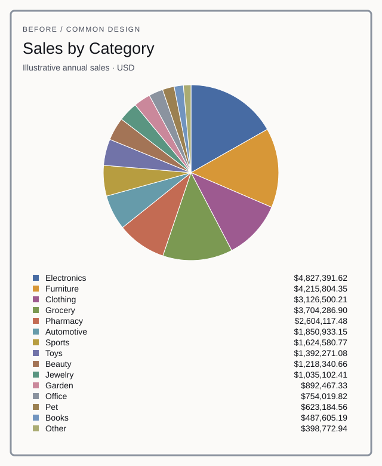
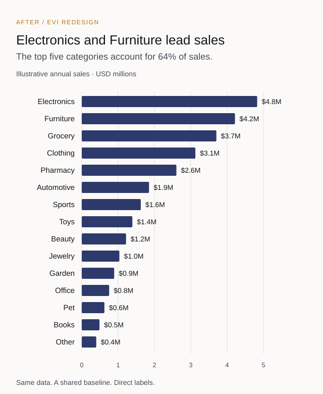

# 15 Categories in a Pie Chart

## A cleaner way to present sales data

A fifteen-slice pie chart can represent sales accurately while making the answer difficult to see. This case study redesigns the report around the question the reader needs to answer:

> Which categories generate the most sales, and how far apart are they?

That is a comparison task. Both versions below use the same fictional annual sales data.

## Before

The reader must distinguish similar angles and areas, remember each color, locate its category in the legend, and repeat. Exact cents add visual noise to a question about relative sales. The generic title describes the data without stating its result.

## After

The horizontal bars use a shared zero baseline. Category names sit beside the bars, values appear at their ends, and descending order exposes the ranking. The title states a finding supported by the data.

**Finding:** Electronics and Furniture lead sales; the top five categories account for 64% of revenue.

## What changed

| Decision | Purpose |
|---|---|
| Pie chart to horizontal bars | Compare lengths from a common baseline. |
| Sort descending | Reveal the ranking without additional interpretation. |
| Label directly | Remove repeated trips between the chart and legend. |
| Use one color | Keep attention on values and reserve emphasis for a reason. |
| Round displayed values | Match precision to the comparison task while preserving exact data separately. |
| Write a descriptive title | State the finding supported by the data. |
| Add whitespace | Separate information without decorative borders. |

## Why the question matters

The correct visual depends on the task:

- **Compare categories:** use ranked bars.
- **Understand concentration:** show the largest categories and a clearly labeled remainder when appropriate.
- **Find change over time:** use a line chart or small multiples.
- **Look up exact values:** use a table with aligned numeric columns.

Enterprise Visual Intelligence begins with the audience and decision, then selects the reporting structure that supports them.

## Review artifacts

- [Design rationale](design-rationale/design-decisions.md)
- [Example client review summary](deliverable-example/review-summary.md)
- [Fictional sample data](sample-data/sales-by-category.csv)
- [Published article](https://arkaisllc.com/articles/15-categories-pie-chart-sales-data/)

## Request a review

Have a report that does not feel right? Email [info@arkaisllc.com](mailto:info@arkaisllc.com?subject=EVI%20Report%20Review) with an anonymized screenshot, who uses it, what they need to understand, and what decision follows.
