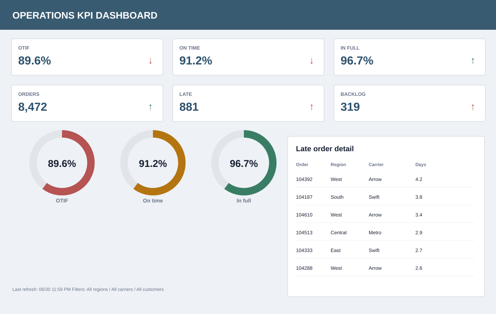
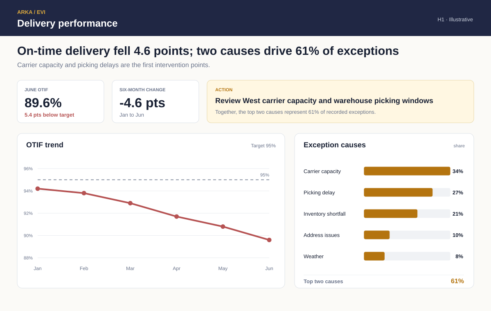

# On-Time Delivery Dashboard

## From status indicators to operational intervention

An operations dashboard should show whether service is changing, how far it is from target, and which causes are actionable.

> What is driving the service decline, and where should operations intervene?

Both versions use the same fictional H1 delivery-performance data.

## Before

The page shows current status but obscures the six-month decline. Three circular gauges repeat related measures, arrows lack context, and the order table lists symptoms without summarizing their causes.

## After

**Finding:** OTIF declined 4.6 points from January to June and finished 5.4 points below target. Carrier capacity and picking delays account for 61% of recorded exceptions.

The redesign moves from signal to diagnosis:

1. State the service decline.
2. Show its size and distance from target.
3. Preserve the six-month trend.
4. Rank the recorded exception causes.
5. Name the first operational review.

## What changed

| Decision | Purpose |
|---|---|
| Six KPI cards to two signals | Keep current performance and change prominent. |
| Gauges to a target line | Show both trend and target distance. |
| Context-free arrows to point changes | State magnitude and period explicitly. |
| Raw order table to ranked causes | Move from individual symptoms to intervention opportunities. |
| Equal treatment to proportional bars | Make the concentration of causes visible. |
| Add an action panel | Connect diagnosis with the next operating review. |

## Review artifacts

- [Design rationale](design-rationale/design-decisions.md)
- [Example review summary](deliverable-example/review-summary.md)
- [Monthly OTIF data](sample-data/monthly-otif.csv)
- [Exception-cause data](sample-data/exception-causes.csv)

All values are fictional and created for this demonstration.

[Explore EVI](https://arkaisllc.com/enterprise-visual-intelligence/) · [Request a report review](mailto:info@arkaisllc.com?subject=EVI%20Report%20Review)
