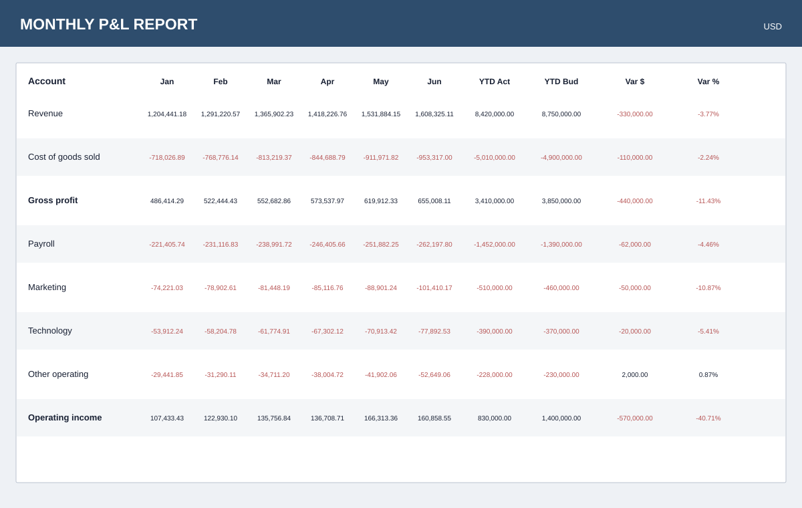
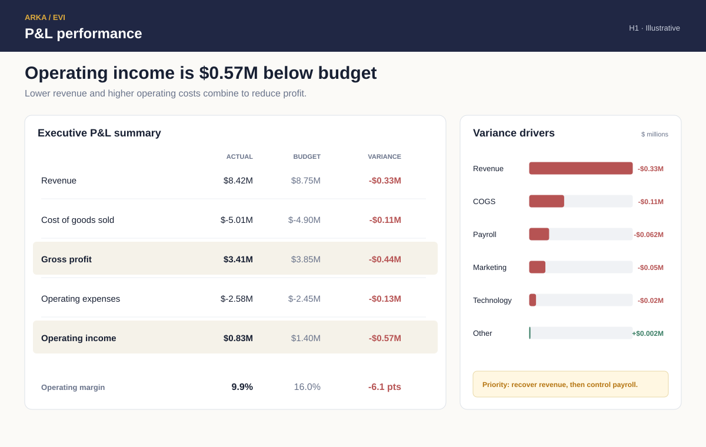

# P&L Variance Report

## From a dense finance table to an executive explanation

A financial report can be complete and still make the material variance difficult to find. This example redesigns a monthly P&L around the question:

> Why is operating income below budget, and which drivers require attention?

Both versions use the same fictional H1 financial summary.

## Before

The wide table supports detailed lookup, but the executive conclusion is buried among monthly values. Negative signs and red text appear throughout, even when a number is an ordinary cost rather than a meaningful adverse variance.

## After

**Finding:** Operating income is $0.57M below budget. Revenue is the largest driver, followed by cost-of-goods and operating-expense pressure.

The summary preserves the P&L sequence while separating three tasks:

- Understand actual performance against budget.
- See the effect on operating margin.
- Identify the drivers large enough to investigate.

## What changed

| Decision | Purpose |
|---|---|
| Monthly detail to executive summary | Keep the principal financial relationships visible. |
| Exact amounts to millions | Match precision to the review level. |
| Red negatives to adverse variances | Use color for business meaning instead of accounting signs. |
| Flat rows to highlighted subtotals | Preserve the P&L hierarchy. |
| Unranked columns to driver bars | Show which variances have the greatest effect. |
| Add an operating-margin comparison | Express the profit effect in a familiar performance measure. |
| Add a priority statement | Connect the variance analysis to action. |

## Review artifacts

- [Design rationale](design-rationale/design-decisions.md)
- [Example review summary](deliverable-example/review-summary.md)
- [P&L summary data](sample-data/pnl-summary.csv)
- [Variance-driver data](sample-data/variance-drivers.csv)

All values are fictional and created for this demonstration.

[Explore EVI](https://arkaisllc.com/enterprise-visual-intelligence/) · [Request a report review](mailto:info@arkaisllc.com?subject=EVI%20Report%20Review)
